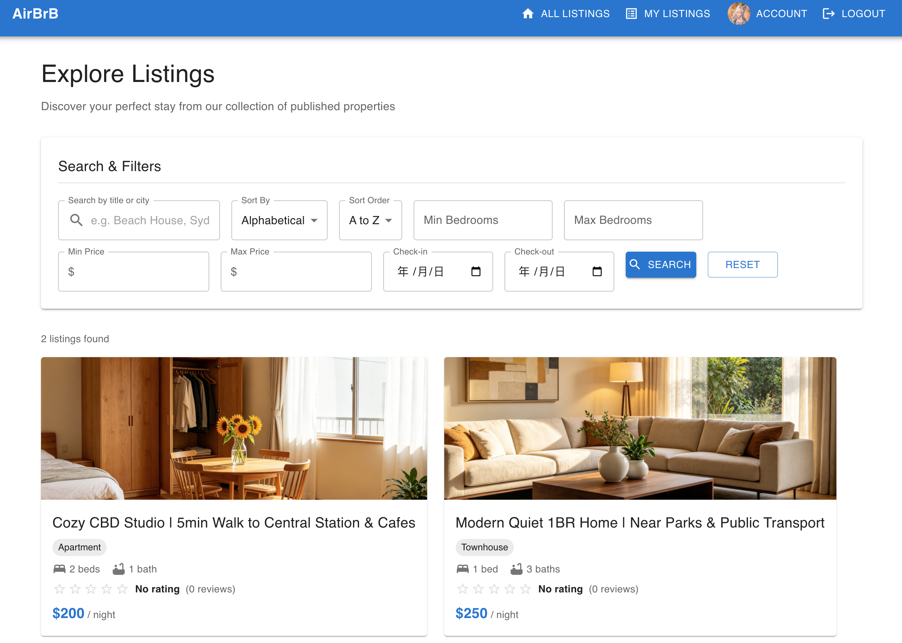
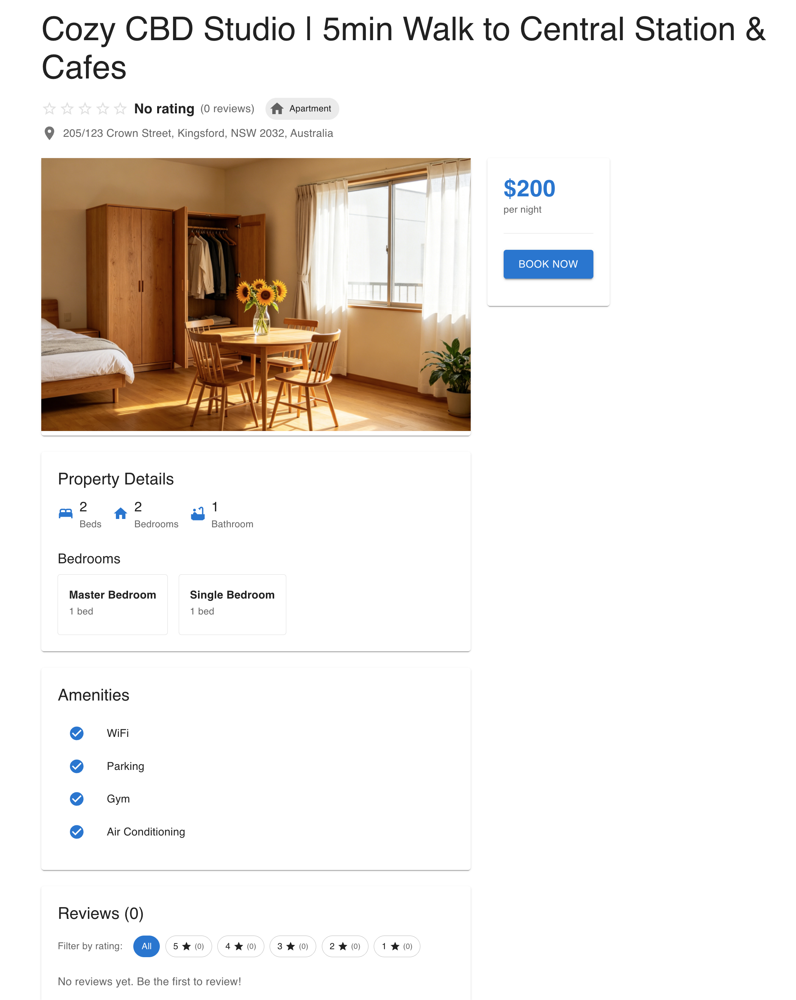
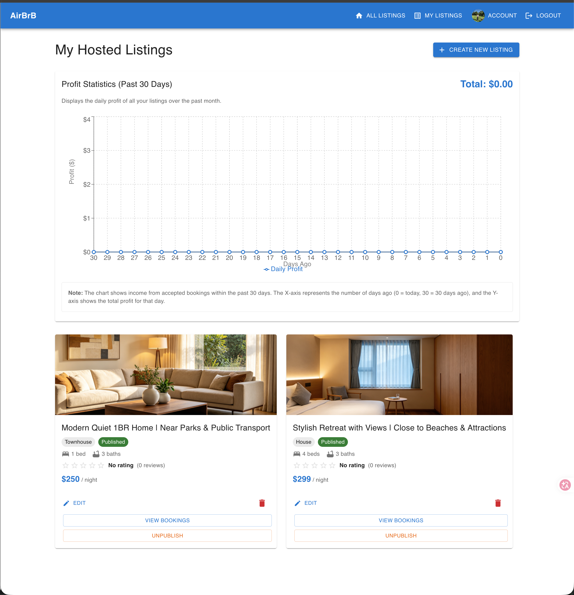
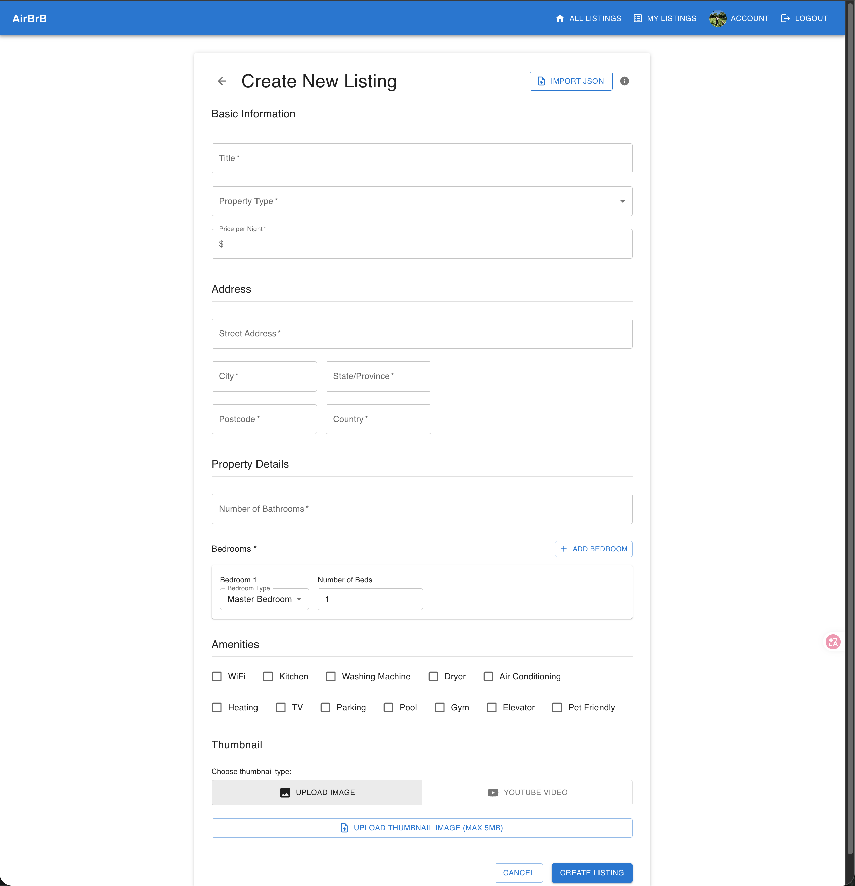

# AirBrB

A full-stack Airbnb-style property rental platform built with React 18 and Express.js. Users can switch between host and guest roles — hosts manage listings and bookings, guests search, book, and review properties.

> **Live Demo**: _coming soon_

---


## Screenshots






---

## Features

### Guest
- Browse all published listings with thumbnail, price, rating, and bedroom count
- Search by title or city; filter by price range, bedroom count, and date availability
- View detailed listing pages with image gallery, amenities, and guest reviews
- Make booking requests and track their status (pending / accepted / declined)
- Leave star ratings and written reviews after a completed stay

### Host
- Create and edit listings with multi-image upload, amenity selection, and YouTube video support
- Publish or unpublish listings with custom availability date ranges
- Accept or decline incoming booking requests
- View a 30-day profit trend chart (Recharts) on the hosted listings dashboard

### Account
- Avatar upload with Canvas API-based client-side image compression
- Inline profile editing (email and password)
- WCAG 2.1 accessibility compliance throughout

---

## Tech Stack

| Layer | Technology |
|---|---|
| Frontend | React 18, Vite, React Router v7 |
| UI Library | Material-UI (MUI) v7 |
| Charts | Recharts |
| Auth | JWT (stored in localStorage) |
| Backend | Express.js, Node.js |
| API Docs | Swagger UI |
| Testing | Vitest, React Testing Library |

---

## Project Structure

```
airbrb/
├── frontend/
│   ├── src/
│   │   ├── pages/          # 9 route-level page components
│   │   ├── components/     # Shared UI (Header, StarRating, ProfitChart, ...)
│   │   ├── services/       # API abstraction layer (auth / listings / bookings / user)
│   │   ├── context/        # AuthContext (global auth state)
│   │   └── hooks/          # useAuth hook
│   └── ...
└── backend/
    └── src/
        ├── server.js       # Express routes
        └── service.js      # Business logic + JSON-based persistence
```

---

## Getting Started

### Prerequisites

- Node.js **v20.17.0** (use [nvm](https://github.com/nvm-sh/nvm))

```bash
nvm install 20.17.0
nvm use 20.17.0
```

### 1. Start the Backend

```bash
cd backend
npm install
npm start
# Running at http://localhost:5005
```

### 2. Start the Frontend

```bash
cd frontend
npm install
npm run dev
# Running at http://localhost:3000
```

Open [http://localhost:3000](http://localhost:3000) in your browser.

### 3. Run Tests

```bash
cd frontend
npm test
```

---

## API

The backend exposes a REST API documented with Swagger. Once the backend is running, visit:

```
http://localhost:5005/docs
```

---

## License

MIT
